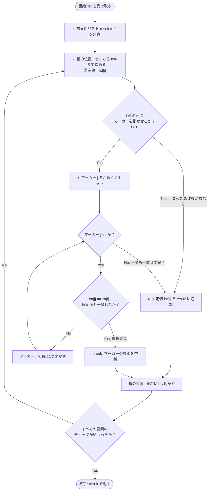

主な原因は、ノードのラベルに `[ ]` や `lst[i]` が入っていて、Mermaid が角かっこをノードの形の指定として読んでしまうことです。ラベルを `"..."` で囲めば直ります。



**直したところ**

- **コードブロックの書き出し:** ` ```mermaid: ` の末尾の `:` を消して ` ```mermaid ` にしました。
- **ノードのラベル:** すべて `"..."` で囲みました。こうすると `[ ]`、`lst[i]`、`==`、`<` などをそのまま書けます。
- **矢印のラベル:** `-- ラベル -->` を `-->|"ラベル"|` の形に変えました。`:` や `=` が入っていても崩れません。

**処理の流れでもう1点（直すかどうかはお任せします）:** 今の図は、`lst[i]` を取り出したあとに「すべての要素のチェックが終わったか？」を判定しています。そのため、空のリストが渡されると存在しない `lst[0]` を読むことになります。Python の `for` 文の動きに合わせるなら、「i < len(lst) か？」という判定を `Init` と `OuterLoop` の間に置くと正確になります。この形に組み直すこともできます。